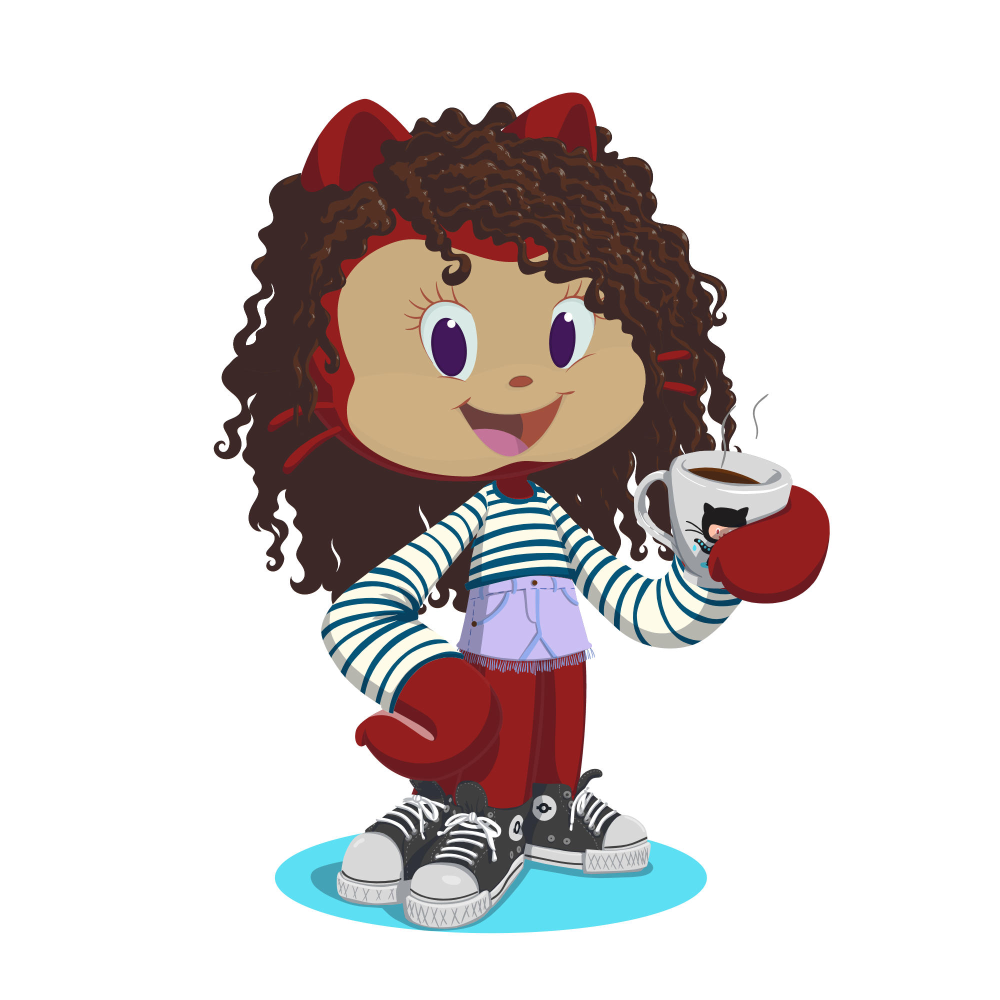

## Oi, Eu sou a Gabriela 😀🖐🏽
## **Desenvolvedora Front-End e Estudante de Ciência de Dados**
 

  <a href="https://github.com/Gabriela1DC">

 
  
  
  
  
  
  
  
  

  
  ##
 

  

  
</a>
   
 

  

 
 
                                                             
  

